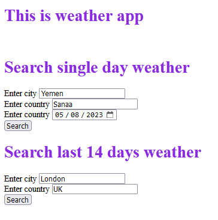
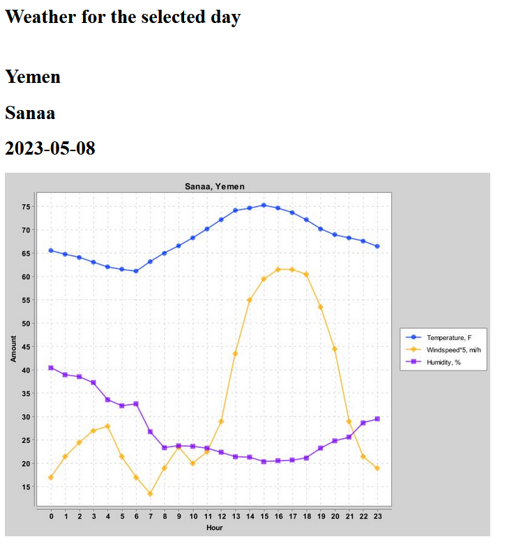
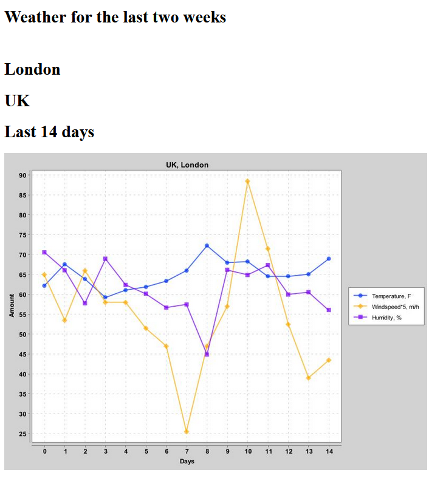

# Weather charts application
This application shows shows weather charts(temperature, humidity, wind speed) in selected city on the world.
You can choose specific date or watch weather on the last two weeks.

Created request to https://www.visualcrossing.com/ and parsed data to JSON, created models(@Entity), servise, repositories, controllers. 
All parsed data saved in MySql database, Charts created via XChart library.

Used: Spring Boot, Data, REST, Hibernate, Maven, SQL(MySql), DI, IOC

      

